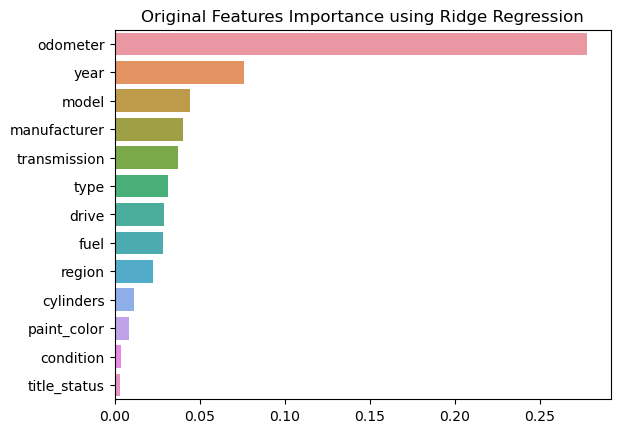

# Features importance for predicting car prices
A data set containing approximately 427K observations originally from Kaggle is considered. From the data we seek to identify features that best predict car prices.
We've used linear regression and ridge regression with appropriate hyperparameter to identify the best features.

## Recommendations
The quality of the fits for the Ridge and Linear regressors are almost identical. The data set's orignal features importance they produce are identical in order too. Thus the recommendation to dealerships would be to, assuming all other features equal:
1. stock cars with lower mileage,
2. stock newer cars,
3. identify pricier make/models to stock

## Next Steps
1. There are serious quality issues with the data. For instance we should seek a data set that contains mostly non-null `size` (full-size, mid-size, etc) for better analysis.
2. Due to hardware constraints we weren't able to take into account the vast majorities of `model` and `region` values. Better hardware clearly shall produce more accurate results.
3. We've only made use of two similar regressors. Other ML algorithms should be included.
4. Better parameter optimization (in our case the hyperparameter $\alpha$ for ridge regression) theoretically shall produce more accurate results.
